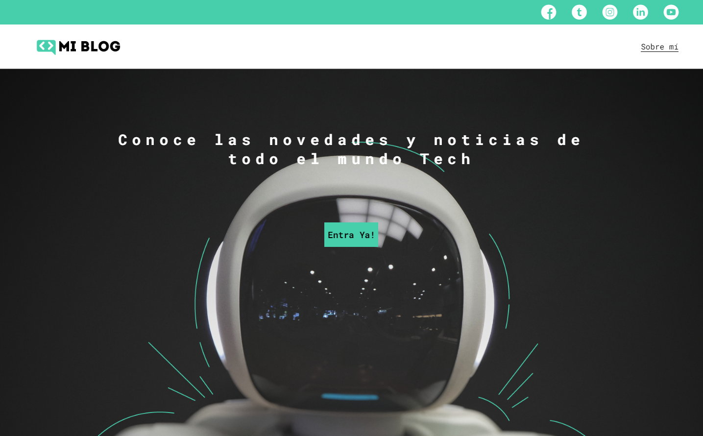
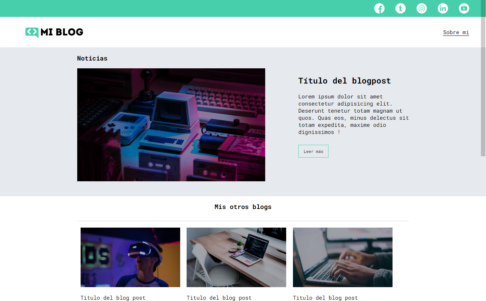
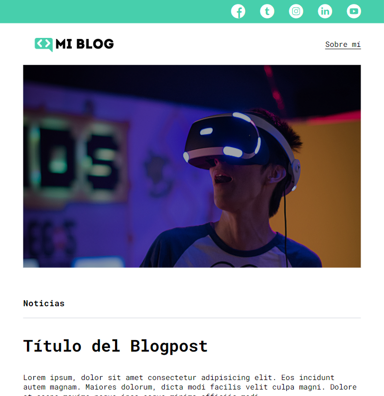

# Curso práctico de Maquetación en CSS

<h3 style="text-align: center";>Blog personal</h3>
- Blog estático donde se aplican diferentes estratégias de maquetación como Flexbox CSS Grid, diseño resposivo entre otros.

<h3 style="text-align: center";>Capturas de panatallas</h3>

#### Home

#### Blogs

#### Detalle del Blog

